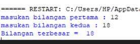
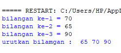
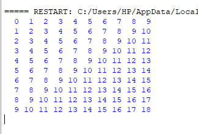
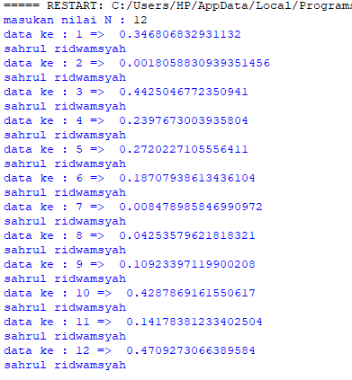

# praktikum4
## latihan 1

#### Mula-mula kita buat input terlebih dahulu contohnya seperti dibawah ini:

a = int(input('masukan bilangan pertama : '))

b = int(input('masukan bilangan kedua : '))

#### Lalu kita enter, masukan if untuk menjalani program yang sebelumnya dan tambahkan x > y : lalu print('Bilangan terbesar = ', x)
#### Kemudian setelah itu tambahkan else untuk menambah aksi untuk menentukan bahwa x lebih besar dari y 

 else :
 
      print('Bilangan terbesar = ', y)
      
#### Dan saat running kita diminta untuk memasukan bilangan pertama lalu bilangan kedua,      
lalu hasil runing nya seperti gambar berikut:




## latihan 2

#### Mula-mula kita membuat input terlebih dahulu contohnya seperti dibawah ini:

a = int(input('bilangan ke-1 = '))

b = int(input('bilangan ke-2 = '))

c = int(input('bilangan ke-3 = '))

#### Kemudian setelah itu kita menambahkan

if a < b:

    if b < c:
    
        print('urutan bilangan : ', a, b, c)
        
    else:
    
        print('urutan bilangan : ', c, a, b)
        
else:

    if a < c:
    
        print('urutan bilangan : ', b, a, c)
        
    else:
    
        if b < c:
        
            print('urutan bilangan : ', b, c, a)
            
         else:
         
            print('urutan bilangan : ', c
            
#### Dan saat di runing kita sebut bilangan yang ini kita urutkan 
#### Lalu hasil dari runing nya seperti gambar berikut:




## latihan 3

#### Mula-mula kita buat koddinagnnya dulu seperti berikut:

#### for i in range(0, 10):

    for j in range(0, 10):
    
        product = i+j
        
        print(f"{product:>3}", end='')
    print()

x = input("masukan angka :")

if x > y:

    print(x, "y")
    
#### print("ini diluar pernyataan if")

#### Maka runingannya akan seperti gambar berikut:




## latihan 4

#### Mula-mula kita buat koddinagnnya dulu seperti berikut:

##### import random

n = int(input("masukan nilai N : "))

for i in range(n):

    a = random.uniform(0.0, 0.5)
    
    print("data ke :", i+1, "=> ", a)
    
    print('Aditya putra wijaya')
    
#### Setelah runing akan diminta masukan nilai n, disini saya memasukan nilai n-nya 12
#### Dan hasil runningannya akan seperti gambar berikut:




## latihan 5


#### Jadi masukan x, y, z sebagai inputan untuk memasukan bilangan
#### Lalu tambahkan if menandakan bahwa x lebih besar dari z lalu tambahkan titik dua 
#### Jadi hasilnya akan seperti ini
If  x > z:
#### Lakukan juga pada x dan y lalu print dan ketik masukan bilangan terbesar,
#### Lalu selanjutnya tambahkan elif, elif sama dengan else yaitu untuk menambah aksi untuk menentukan bahwa x lebih besar dari z dan y lebih besar dari z,
#### Setelah menjalani codingan sperti penjelasan dan gambar di atas lalu runing


#### Setelah runing masukan bilangan dari yangterbesar hingga terkecil hingga hasil akhirnya menunnjukan bilangan terbesar dari tiga bialangan yg di sebut

## latihan 6


#### Pertama-tama kita print dan masukan nama kita 
#### Lalu masukan n, =, dan 1, lalu enter dan masukan a, =, dan 0. jadi keliahatnnya seprti ini:
```
n=1
a=0
```
#### Fungsinya adalah untuk menentukan nilai terbesar, lalu enter dan tambahkan while n, !, =, 0, dan :. setelah itu enter, nah pas saat enter pastikan tidak sejajar dengan while, setelah itu tambahkan if n, >, a, dan : enter lalu tambahkan a = n, kemudian enter tambahkan n dan = lalu input ketik masukan bilanagan Gunakan (, :, dan " sebagai syntax nya, lalu lanjut enter dan tambahkan if, n, ==, 0, dan : enter dan masukan break tidak sejajar dengan if, enter masukan prinan sperti sbmnya bedanya tambahkan a. jadi keliatannya seperti ini:
```
while n !=0:

    if n > a:
        a = n
    n = int(input("masukan Bialangan: "))
    
    if n == 0:
        break
    print("Nilai terbesarnya adalah:", a)
```
#### Fungsinya adalah memasukan niali terbesar.


#### Setelah runnuing dari hasil kodingan di atas lalu masukan bilangan terbesar lalu enter dam asukan nilai yang lebih kecila kemudian enter lagi dan akan menentukan nilai terbesarnya.

## latihan 7


#### Gunanya menambahkan kodingan sperti diatas adalah untuk menghitung laba dari bulan kesatu hingga ke 8


